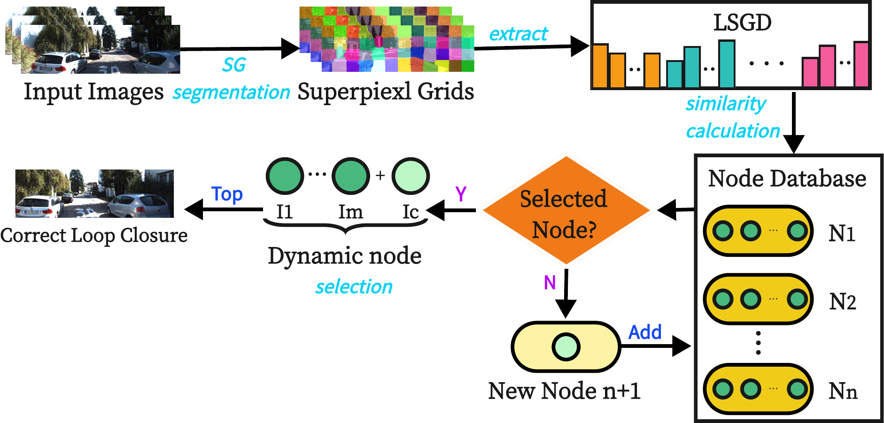

# LSGDDN-LCD

LSGDDN-LCD is an online appearance-based visual loop closure detection method that utilizes local superpixel grid descriptors and dynamic nodes. Unlike traditional bag-of-words (BoW) based methods, LSGDDN-LCD incorporates an adaptive mechanism called "dynamic node" to dynamically adjust the database in real-time, enabling efficient retrieval of previously viewed images without the need for pre-training.

LSGDDN-LCD leverages hand-crafted features extracted from local superpixel grid descriptors (LSGD) to identify similarities between scenes. This approach addresses significant challenges faced by current appearance-based loop closure detection methods, such as high computational costs, viewpoint variance, and dynamic objects in scenes.

#### Pipeline:

## Prerequisites
We have tested the library in Ubuntu 18.04, but it should be easy to compile in other platforms.

- [OpenCV 3](https://github.com/opencv/opencv)
- [Eigen 3](https://eigen.tuxfamily.org/dox/)
- [OpenMP](https://www.openmp.org/)
- yaml-cpp

## Compile

    mkdir ~/lsgddn-lcd
    cd ~/lsgddn-lcd
    git https://github.com/BaoshengZhang0/LSGDDN-LCD.git
    ./cmake.sh

## Usage

### NEU Dataset:
You can download the [NEU](https://drive.google.com/drive/folders/1-tRfQ3cKriTVYb2mmEyF45Ij1mHpRjkX?usp=sharing) dataset for research purposes.

### Running package:
Before using the package, you need to set the input dataset and output result paths with the file paths on your computer in the `./config/config.yaml` file.

    cd ./bin
    ./LSGDDN

### Using tools:
In the `./tools` folder, we provide tools for visualizing similarity scores and calculating precision-recall results.

